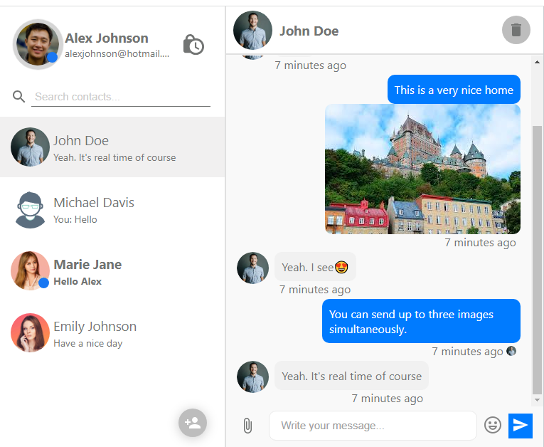

# Real-Time Chat Application

A real-time chat application built with the MERN stack, MongoDB, Express.js, React.js, and Node.js. The application allows users to create conversations, send messages and photos, and interact with other users in real time using Socket.IO.

## Server Dependencies

- [Express.js](https://expressjs.com/)
- [MongoDB](https://www.mongodb.com/)
- [Mongoose](https://mongoosejs.com/)
- [Socket.io](https://socket.io/)
- [Multer](https://github.com/expressjs/multer)
- [Bcrypt](https://github.com/kelektiv/node.bcrypt.js)
- [Express-Validators](https://www.npmjs.com/package/express-validators)
- [Http-errors](https://www.npmjs.com/package/http-errors)
- [Cors](https://www.npmjs.com/package/cors)
- [Dotenv](https://www.npmjs.com/package/dotenv)
- [Jsonwebtoken](https://www.npmjs.com/package/jsonwebtoken)
- [Faker](https://github.com/Marak/faker.js) -- Dev
- [Eslint](https://eslint.org/) -- Dev
- etc.

## Client Dependencies

- [React.js](https://reactjs.org/docs/getting-started.html)
- [Material-UI](https://mui.com/)
- [React Redux](https://react-redux.js.org/)
- [Axios](https://github.com/axios/axios)
- [Jwtdecode](https://www.npmjs.com/package/jwtdecode)
- [Timeago](https://www.npmjs.com/package/timeago.js)
- [Socket.io-client](https://socket.io/)
- [Prettier](https://prettier.io/) -- Dev
- etc.

## Features

- User registration and authentication
- Create new conversations
- Send and receive real-time messages and photos
- Display online users
- Real-time seen functionality
- Notification for new messages
- Responsive and user-friendly interface

## Installation

1. Clone the repository: `git clone https://github.com/Arabin1/Chat_Application.git`
2. Install dependencies for the server: `cd server && npm install`
3. Install dependencies for the client: `cd client && npm install`
4. Start the server: `cd server && npm start`
5. Start the client: `cd client && npm start`
6. Open your browser and navigate to `http://localhost:3000` to view the application.

Make sure you have the following packages installed on your machine.
- [node](https://nodejs.org/en/download)
- [nodemon](https://www.npmjs.com/package/nodemon)
- [mongoDB](https://www.mongodb.com/docs/manual/installation/)

## Deployment

To deploy the application to a live system or hosting platform, follow these steps:

1. Set up a MongoDB database and obtain the connection URL.
2. Configure the server environment variables in the `server/.env` file.
3. Build the client for production: `cd client && npm run build`
4. Deploy the server and client to a hosting platform like Heroku or Vercel.
5. Set the necessary environment variables for production deployment.

## Usage

1. Open the application in your browser.
2. Sign up for a new account or log in with existing credentials.
3. Create new conversations with other users or join existing conversations.
4. Send and receive real-time messages with other participants.
5. Interact with other users and explore the chat features.

## Contributing

Contributions are welcome! If you'd like to contribute to this project, please follow these guidelines:

1. Fork the repository and clone it locally.
2. Create a new branch for your feature or bug fix.
3. Make your changes and commit them with descriptive commit messages.
4. Push your changes to your forked repository.
5. Submit a pull request, explaining your changes and their purpose.

## License

This project is licensed under the [MIT License](LICENSE).

## Contact

For any inquiries or questions, please contact [Md. Asaduzzaman (Arabin)](mailto:aznarabin@gmail.com).
